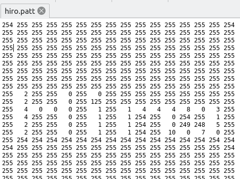

# pymarker
A python package to generate AR markers and patterns based on input images.

## Usage

Pymarker has 2 main features, generating Pattern files (.patt) and Markers (.png). The marker will be used by the user to visualize some augmented reality, the pattern file for the system to be able to recognize the marker.

An example input image:


Expected output patt:


Expected output marker:


### Commands

By default pymarker receives an image and generate both patt and marker
```bash
$ pymarker tests/input/hiro.jpg
```   

However, if needed the flag `-p` or `--patt` can gerate only the patt file for the input:

```bash
$ pymarker -p tests/input/hiro.jpg
// or
$ pymarker --patt tests/input/hiro.jpg
```

The same can happen for markers using the `-m` or `--marker` which generates only the marker:

```bash
$ pymarker -m tests/input/hiro.jpg
// or
$ pymarker --marker tests/input/hiro.jpg
```

The marker border size can be adjusted with `-b`, the default value being 84px.
```bash
$ pymarker -b 40 tests/input/hiro.jpg
```
